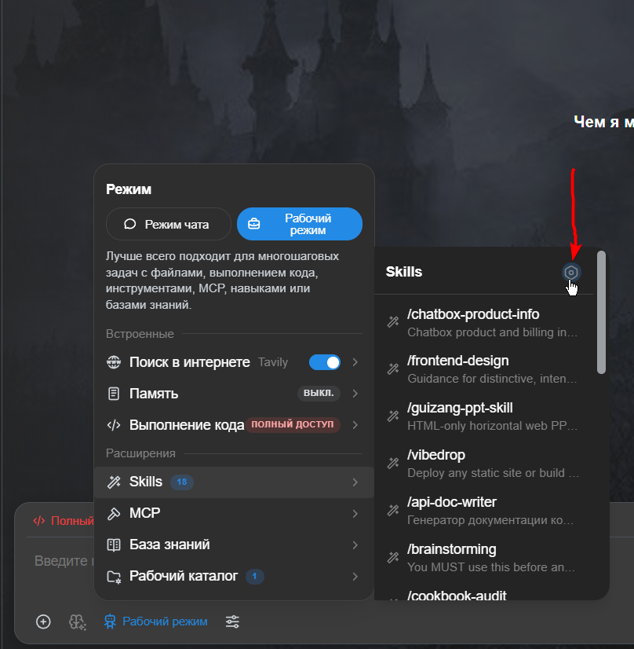
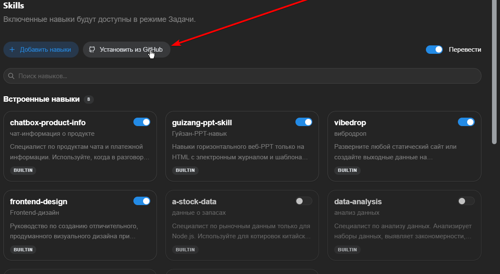
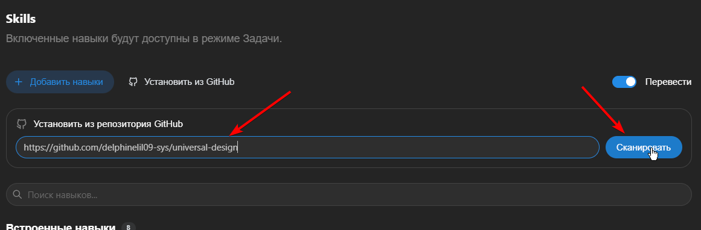
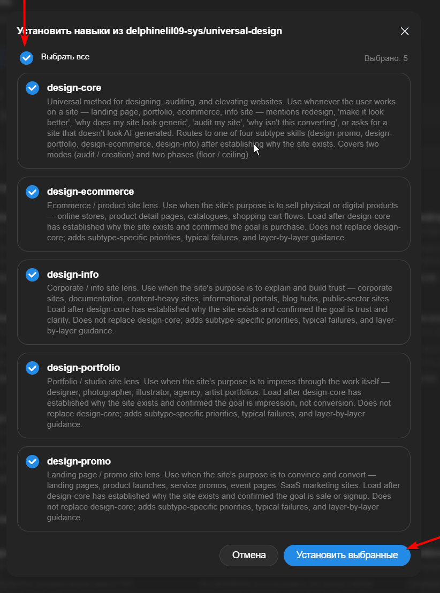

# Universal Design

Five Chatbox skills for designing and fixing websites — landing pages, portfolios, stores, corporate sites. The goal isn't "modern" or "premium." It's a site that doesn't look like a template, and doesn't look AI-generated either.

## The idea

Most AI-built sites fail the same way: they're assembled, not designed. A hero, rounded cards, a gradient, the same spacing everywhere. It looks *finished* and feels dead.

This skill set works the other way around. Before touching anything, it asks why the site exists. Then it moves top-down — frame, body, surface, accent — and only touches details once the structure is right. In audit mode it finds what's objectively broken (contrast, hit targets, text size) and fixes it without asking permission. The personality part — the ceiling — is never invented for you. Either you bring the idea and the reference, or the site stays correct but plain. That's a feature, not a limitation.

## Layout

```
design-core/          the method: entry steps, modes, phases, routing
├── SKILL.md
└── references/
    ├── elements.md       — the eight elements (point, line, form, …)
    ├── layers.md         — the four layers and how to move through them
    ├── audit-grid.md     — what "broken" means, element by element
    ├── generation.md     — turning a brief into a site
    ├── marketing.md      — conversion as a filter, not a ninth element
    └── trends-2026-Q3.md — what looked good in Q3 2026 (a snapshot, not a law)

design-promo/         landing pages and product launches
design-portfolio/     portfolios and studios
design-ecommerce/     stores and product pages
design-info/          corporate and documentation sites

_evals/               test prompts — dev tooling, not a skill
```

The four lenses are thin on purpose. They add what's specific to their type and defer everything else to the core. If you ever see `design-ecommerce` explaining the eight elements, that's a bug — it shouldn't.

## Install (Chatbox)

The easiest way — through the Chatbox interface.

### 1. Open the Skills panel

In **Work mode**, click the **Skills** icon in the top-right corner.



### 2. Click "Install from GitHub"



### 3. Paste the repository URL

```
https://github.com/delphinelil09-sys/universal-design
```

and click **Scan**.



### 4. Select all five skills and click "Install selected"



After install, **restart Chatbox** — skills load on app start, not on chat start.

> **Important:** `design-core` must be first in the skills list. If a generic request ("make my site look better") routes straight to a subtype lens, the method is skipped.

**Chatbox loads skills from a `skills` folder next to its app data. Where that lives depends on your OS:

| OS | Path |
|---|---|
| Windows | `C:\Users\<you>\AppData\Roaming\xyz.chatboxapp.app\skills` |
| macOS | `~/Library/Application Support/xyz.chatboxapp.app/skills` |
| Linux | `~/.config/xyz.chatboxapp.app/skills` |

Clone the repo and copy the five `design-*` folders in:

```bash
git clone https://github.com/delphinelil09-sys/universal-design
cd universal-design
```

```powershell
# Windows (PowerShell)
$skills = "$env:APPDATA\xyz.chatboxapp.app\skills"
Copy-Item design-core design-promo design-portfolio design-ecommerce design-info $skills -Recurse
```

```bash
# macOS / Linux
cp -r design-core design-promo design-portfolio design-ecommerce design-info \
  "$HOME/Library/Application Support/xyz.chatboxapp.app/skills"   # macOS
  # or: ~/.config/xyz.chatboxapp.app/skills                       # Linux
```

Restart Chatbox. Don't copy `_evals/` — it's for testing, not for the skills folder.

The order matters: `design-core` must come first so generic requests ("make my site look better") land in the method, not straight in a lens. Alphabetical order already does this for you — don't rename the folders.

## Using it

Start a new session and just talk:

- *"Here's my landing page, it looks generic. Fix it."* — audit mode, objective fixes.
- *"A portfolio for a ceramicist. Quiet, warm, like holding a mug."* — creation mode, top-down, your words become the direction.
- *"Make it beautiful."* — it will ask questions instead of guessing. That's the skill working, not failing.

## Maintenance

One file is meant to be replaced, not edited: `trends-2026-Q3.md`. Trends are a dated snapshot — when the season turns, swap the whole file. The structure is built for that.

## License

MIT, © delphinelil09 — do what you want with it, just keep the notice.
